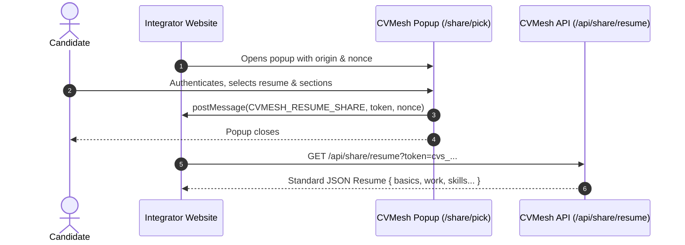

# CVMesh Fetcher Monorepo

Multi-package repository providing client libraries for third parties to integrate with the [CVMesh](https://cvmesh.net) **Open Resume Share** protocol.

## Packages

| Package | Version | Description |
| --- | --- | --- |
| [`@cvmesh/fetcher`](./packages/fetcher) | `1.0.0` | Framework-agnostic TypeScript/JavaScript library to request and fetch resumes with zero dependencies. |
| [`@cvmesh/react`](./packages/react) | `1.0.0` | React hooks and provider (`useFetchResume`, `CVMeshProvider`) to wire resume fetching onto any existing button or workflow. Compatible with React 17, 18, and 19. |

---

## What is the Open Resume Share Protocol?

The Open Resume Share Protocol allows job boards, Applicant Tracking Systems (ATS), and career portals to fetch verified, ATS-compliant candidate resume data in standard [JSON Resume](https://jsonresume.org/schema) format without requiring:

- Developer account registration
- Client IDs or secrets
- Complex OAuth 2.0 backend redirects

### How It Works



---

## Development

This repository uses **pnpm workspaces** and **Turborepo**.

### Prerequisites

- [Node.js](https://nodejs.org/) `>= 18`
- [pnpm](https://pnpm.io/) `>= 9`

### Setup

```bash
# Install all dependencies across all packages
pnpm install

# Build all packages (ESM + CJS + TypeScript declarations)
pnpm run build

# Run unit tests across all packages
pnpm run test

# Typecheck all packages
pnpm run lint

# Clean all build outputs
pnpm run clean
```

---

## License

MIT © [CVMesh](https://cvmesh.net)
